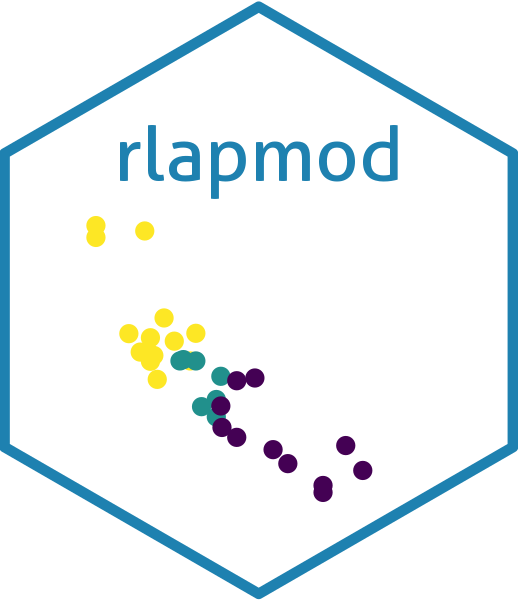

<!-- README.md is generated from README.Rmd. Please edit that file -->

# rlapmod 

<!-- badges: start -->

[](https://github.com/maxbre/rlapmod/actions/workflows/R-CMD-check.yaml)
[](https://www.codefactor.io/repository/github/maxbre/rlapmod)
[](https://github.com/maxbre/rlapmod)
[](https://lifecycle.r-lib.org/articles/stages.html#experimental)
[](https://github.com/maxbre/rlapmod)
<!-- badges: end -->

A collection of my handy R functions for post-processing the output of
LAPMOD modeling system.

Beware: all the material must be considered experimental, in full
development and not yet tested.

Caveat emptor: use it at your own risk.

### Installation

You can install the development version of the package ‘raermod’ from
the repository at [GitHub](https://github.com/maxbre/rlapmod/) with:

``` r
if(!require("devtools")) install.packages("devtools")
devtools::install_github("maxbre/rlapmod")
```

### Pay attention!

This package is dependent by some functions provided by another package
(of mine), that needs to be installed first!

So, here again, it goes like:

``` r
if(!require("devtools")) install.packages("devtools")
devtools::install_github("maxbre/rfunctions")
```
